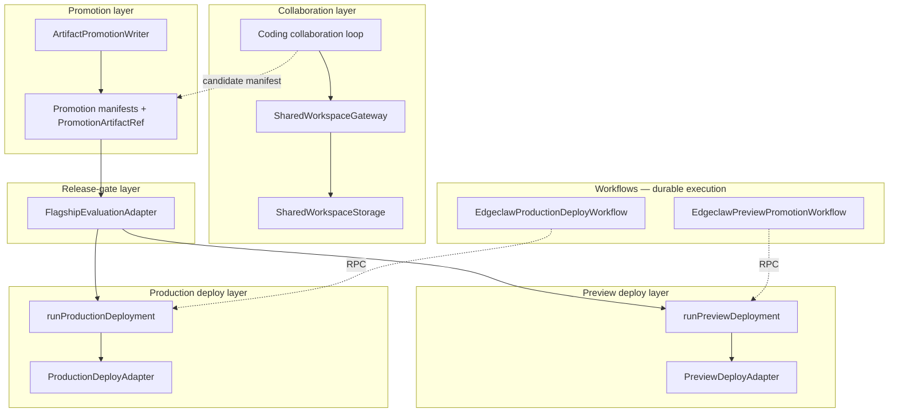
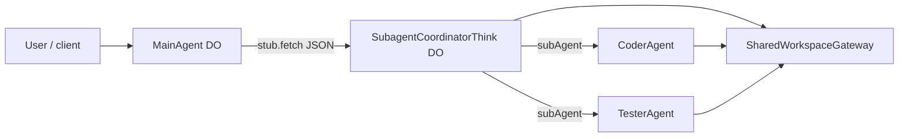

# Coding platform architecture — layers, adapters, and cutover

This document is the **canonical map** of the parent/sub-agent coding platform: collaboration, promotion, release gates, deploy seams, and Cloudflare Workflows. It complements:

- [`operator-live-readiness-checklist.md`](./operator-live-readiness-checklist.md) — bindings, env vars, validation phases, `promotionPlatformDiagnostics`
- [`agent-orchestration-boundaries.md`](./agent-orchestration-boundaries.md) — role × tool × orchestrator-only APIs
- [`preview-deploy-cloudflare.md`](./preview-deploy-cloudflare.md) — verified adapter + optional Workers Versions stub upload + witness
- [`production-deploy-cloudflare.md`](./production-deploy-cloudflare.md) — production verified adapter + deferred enterprise rollout

---

## 1. Layer diagram

**Interpretation:** Collaboration produces **candidates**; promotion **writes** durable manifests; the release gate **evaluates policy**; preview and production deploy are **separate orchestrator-only seams** (see factories below). Workflows **retry and checkpoint** long-running promotion/deploy paths by delegating to **MainAgent** methods on the orchestrator DO — they do not replace adapters.

### Sub-agent coding orchestration (canonical when `SUBAGENT_COORDINATOR` is bound)

**User-facing chat, MCP, browser, voice, and workflows** remain on **`MainAgent`**. The **manager ↔ coder ↔ tester** loop (`runCodingCollaborationLoop` and direct `delegateToCoder` / `delegateToTester` calls) routes through a dedicated **`SubagentCoordinatorThink`** Durable Object when **`env.SUBAGENT_COORDINATOR`** is bound: MainAgent issues **`stub.fetch`** with **JSON-only** bodies to the coordinator DO; the coordinator then calls **`subAgent(CoderAgent|TesterAgent)`** and `rpcCollectChatTurn` / `rpcCollectStatelessModelTurn` as before. **Shared workspace** remains the same logical surface: **`SharedWorkspaceGateway`** + `SHARED_WORKSPACE_KV` (same Worker bindings are visible from MainAgent, the coordinator, and child facets for a given `sharedProjectId`).

When the binding is **absent**, MainAgent uses the **legacy** path (`this.delegateTo` + `subAgent` from the MainAgent facet) for compatibility (e.g. local dev without the extra DO class).

### Coding loop vs promotion (end-to-end)

This is the **collaboration** path (KV-backed shared workspace) and how it **connects** — or does not — to **promotion** (R2 / Cloudflare Artifacts manifests). See also [`agent-orchestration-boundaries.md`](./agent-orchestration-boundaries.md) (storage table) and `src/agents/codingLoop/promotionFromCodingLoop.ts` (orchestrator bridge; **no** artifact write inside that module).

| Step | What happens | Where it lives |
|------|----------------|----------------|
| **1 — Coder** | Receives a delegated turn; may generate staging text and patch proposals via tools such as **`shared_workspace_write_staging`** (under `staging/…` only) and **`shared_workspace_put_patch`**. | Child **CoderAgent** (coordinator or MainAgent path). |
| **2 — Persist** | Gateway writes files, patch records, and verification blobs under a **`sharedProjectId`**. | **`SharedWorkspaceGateway`** → **`SharedWorkspaceStorage`** — today implemented with **`SHARED_WORKSPACE_KV`** (logical keys under `sw/v1/proj/<projectId>/…`). Not canonical git history; git is a separate seam (`src/repo/`). |
| **3 — Tester** | Reads via **`shared_workspace_read`**, lists patches, reads proposals; records verification. **Does not** approve/apply canonical tree writes. | Child **TesterAgent**, same gateway + KV. |
| **4 — Approve / apply** | **`runCodingCollaborationLoop`** calls **`approvePatch` / `applyPatch`** with orchestrator role on the gateway when policy allows (tester PASS + scoped targets, etc.). | **Still KV** — patch lifecycle moves **pending → approved → applied** in shared workspace storage. When **`SUBAGENT_COORDINATOR`** is bound, the **coordinator DO** often runs this loop and holds the orchestrator gateway; **MainAgent** (or debug HTTP) still **starts** the loop. |
| **5 — Promotion** | **Not automatic** when the loop ends. Orchestrator (**MainAgent** only for artifact write / gate) runs **`derivePromotionCandidateFromCodingLoop`** → may prepare an in-memory manifest → **`buildPromotionArtifact`** writes durable manifests to **Artifacts or R2** (`PROMOTION_ARTIFACTS_*`), then **`evaluateReleaseGate`**, preview/production pipelines / **Workflows** as configured. | **Promotion layer** — separate from collaboration KV. The coding loop does **not** call `buildPromotionArtifact` or the release gate; that stays an explicit orchestrator step. |

**Summary:** Steps 1–4 are **collaboration in `SHARED_WORKSPACE_KV`**. Step 5 is **downstream promotion** — only when you invoke the promotion seam (chat tools, `MainAgent` methods, or Workflow RPC), not as a side effect of apply.

**Debug / isolation:** HTTP routes under `/api/debug/*` and WebSocket `@callable` probes (A/B/C/Ping, child-turn flags) are for diagnostics only; they do not redefine the canonical collaboration contract above.

---

## 2. Canonical vs transitional adapters

Labels used below:

- **Canonical** — what new environments should enable when prerequisites exist (steady-state intent).
- **Compatibility** — supported backward-compatible paths; may remain indefinitely for existing deployments.
- **Fallback** — safe default when prerequisites are missing or explicitly disabled (often noop adapters).

| Seam | **Canonical** | **Compatibility / fallback** |
|------|----------------|-------------------------------|
| **Promotion persistence** | **Native Cloudflare Artifacts** — `ENABLE_PROMOTION_ARTIFACTS_CF_ARTIFACTS=true` + `ARTIFACTS` bound → `createArtifactsArtifactPromotionWriter` | **Compatibility:** **R2** `createR2ArtifactPromotionWriter` when `PROMOTION_ARTIFACTS_BUCKET` is bound and the Artifacts branch is not selected. **Fallback:** `createNoopArtifactPromotionWriter` when neither path applies or R2 is explicitly disabled without Artifacts (`ENABLE_PROMOTION_ARTIFACTS_R2=false`). |
| **Release gate** | **Flagship Workers binding** — `ENABLE_FLAGSHIP_BINDING=true` + `FLAGS` bound → `createBindingFlagshipEvaluationAdapter` | **Compatibility:** **HTTP** `FLAGSHIP_EVALUATION_URL` + `createHttpFlagshipEvaluationAdapter` when the binding branch does not run and `ENABLE_FLAGSHIP_HTTP` is not off — external policy or migration. **Fallback:** noop adapter when neither applies. |
| **Preview deploy** | **Promotion-verified** `createPromotionArtifactVerifiedPreviewDeployAdapter` (same writer as promotion) + optional **Workers Versions stub upload** to a separate script (`ENABLE_PREVIEW_WORKER_VERSION_UPLOAD` + `PREVIEW_WORKER_UPLOAD_SCRIPT_NAME` + token) + optional **script-settings witness** | **Compatibility:** legacy kill-switch env name **`ENABLE_PREVIEW_DEPLOY_R2`** (misleading name — gates **all** verified preview, not R2-only); **fallback:** noop when kill switch or no `hasArtifactPromotionPersistence`. |
| **Production deploy** | **Promotion-verified** `createPromotionArtifactVerifiedProductionDeployAdapter` + optional production witness | **Fallback:** noop when `ENABLE_PRODUCTION_DEPLOY=false` or no durable promotion persistence. |
| **Preview promotion: Workflow vs sync** | **`runPreviewPromotionWorkflow`** + **`EdgeclawPreviewPromotionWorkflow`** — durable `step.do` checkpoints, retries, same `PreviewPromotionPipelineHost` RPC surface | **Compatibility:** **`runPreviewPromotionPipeline`** — synchronous in-process pipeline for tests, tooling, and single-request flows; **not** a substitute for Workflow durability in production-style long runs. |
| **Tests / fixtures** | Inject `ArtifactPromotionWriter` into verified constructors | **Compatibility:** `createR2VerifiedPreviewDeployAdapter` — R2-only test helper; delegates to verified preview. |
| **Coder/Tester delegation** | **`SUBAGENT_COORDINATOR`** bound → **`SubagentCoordinatorThink`**; MainAgent → `stub.fetch` JSON → coordinator → `subAgent(CoderAgent|TesterAgent)` | **Compatibility:** omit binding → MainAgent **`delegateTo`** + `subAgent` from the MainAgent facet (legacy; useful for minimal local setups). |

**Cutover decisions (why):**

1. **Noop → verified:** Verified adapters mean **re-read manifest, digest match**, optional **stub Workers version upload** (preview) and optional **script-settings** witness — not full production binary upload. Noop stays the safe default when persistence or flags are off.

2. **R2 vs Artifacts:** **Artifacts are not auto-preferred when “both exist”.** Precedence is **explicit**: opt-in Artifacts (`ENABLE_PROMOTION_ARTIFACTS_CF_ARTIFACTS` + binding) **first** in `resolveArtifactPromotionWriter`; otherwise R2 if bucket present and R2 not disabled; else noop. This avoids silent URI migration for existing R2-only deployments.

3. **HTTP Flagship vs binding:** **Binding wins when explicitly enabled and `FLAGS` is bound** (`resolveFlagshipEvaluationAdapter`). HTTP is **compatibility** for external policy services or gradual migration; set **`ENABLE_FLAGSHIP_HTTP=false`** to remove HTTP fallback once binding is authoritative.

4. **Workflow vs sync:** Same business steps and adapter factories; Workflows add **durability** around calls into MainAgent — choose Workflow when retries/checkpoints matter.

---

## 3. Factory precedence (explicit)

### `resolveArtifactPromotionWriter` (`artifactPromotionWriterFactory.ts`)

1. If `ENABLE_PROMOTION_ARTIFACTS_CF_ARTIFACTS` is true **and** `env.ARTIFACTS` is bound → **`createArtifactsArtifactPromotionWriter`**
2. Else if `ENABLE_PROMOTION_ARTIFACTS_R2` is false → **noop**
3. Else if `PROMOTION_ARTIFACTS_BUCKET` missing → **noop**
4. Else → **`createR2ArtifactPromotionWriter`**

### `resolveFlagshipEvaluationAdapter` (`flagshipEvaluationAdapterFactory.ts`)

1. If `ENABLE_FLAGSHIP_BINDING` is true **and** `env.FLAGS` is bound → **binding adapter**
2. Else if `ENABLE_FLAGSHIP_HTTP` is not off **and** `FLAGSHIP_EVALUATION_URL` is set → **HTTP adapter**
3. Else → **noop**

### `resolvePreviewDeployAdapter` (`previewDeployAdapterFactory.ts`)

1. If `ENABLE_PREVIEW_DEPLOY_R2` is false → **noop** (legacy kill-switch name; see §2)
2. Else if `!hasArtifactPromotionPersistence(env)` → **noop**
3. Else → **promotion-verified preview** with `resolveArtifactPromotionWriter(env)`
4. If `ENABLE_PREVIEW_WORKER_VERSION_UPLOAD` and account id + API token + `PREVIEW_WORKER_UPLOAD_SCRIPT_NAME` → wrap with **Workers Versions stub upload** (after verification, before witness)
5. If `ENABLE_PREVIEW_DEPLOY_CF_WITNESS` and account id + API token → wrap with **script-settings witness**

### `resolveProductionDeployAdapter` (`productionDeployAdapterFactory.ts`)

1. If `ENABLE_PRODUCTION_DEPLOY` is false → **noop**
2. Else if `!hasArtifactPromotionPersistence(env)` → **noop**
3. Else → **promotion-verified production** with `resolveArtifactPromotionWriter(env)`
4. If `ENABLE_PRODUCTION_DEPLOY_CF_WITNESS` and account id + API token → wrap with **production witness**

**Preview and production factories never call each other.**

---

## 4. Migration plan (operator checklist)

### A. Noop → verified deploy adapters

| Step | Action |
|------|--------|
| 1 | Bind **`PROMOTION_ARTIFACTS_BUCKET`** (and/or enable Artifacts per below); ensure `ENABLE_PROMOTION_ARTIFACTS_R2` is not `"false"` unless intentionally Artifacts-only |
| 2 | Set **`ENABLE_PREVIEW_DEPLOY_R2`** to anything other than `"false"` (unset = verified preview allowed when persistence exists) |
| 3 | Set **`ENABLE_PRODUCTION_DEPLOY`** not `"false"` when you want verified production path |
| 4 | Optionally set **`PREVIEW_DEPLOY_PUBLIC_URL`** / **`PRODUCTION_DEPLOY_PUBLIC_URL`** for stable URL reporting |
| 5 | Optional witnesses: **`ENABLE_PREVIEW_DEPLOY_CF_WITNESS`** / **`ENABLE_PRODUCTION_DEPLOY_CF_WITNESS`** + secrets |

### B. R2 → native Artifacts (when ready)

| Step | Action |
|------|--------|
| 1 | Add **`artifacts`** binding in `wrangler.jsonc` |
| 2 | Set **`ENABLE_PROMOTION_ARTIFACTS_CF_ARTIFACTS=true`** |
| 3 | Configure **`PROMOTION_ARTIFACTS_REPO_NAME`** if not default |
| 4 | Plan URI cutover: new manifests use Artifacts URIs; **existing `PromotionArtifactRef` values pointing at R2 remain valid** until bundles age out |
| 5 | Optionally set **`ENABLE_PROMOTION_ARTIFACTS_R2=false`** to **force** noop writer when Artifacts should be the only backend (requires Artifacts branch to satisfy `hasArtifactPromotionPersistence`) |

### C. HTTP Flagship → binding-backed Flagship

| Step | Action |
|------|--------|
| 1 | Configure **`flagship`** in `wrangler.jsonc` with **`FLAGS`** binding |
| 2 | Set **`ENABLE_FLAGSHIP_BINDING=true`** |
| 3 | Align **`FLAGSHIP_RELEASE_GATE_FLAG_KEY`** with your Flagship string flag |
| 4 | Optionally set **`ENABLE_FLAGSHIP_HTTP=false`** to disable HTTP fallback even if URL is still in vars |

---

## 5. Workflow responsibilities

**Same adapters, different durability:** `runPreviewPromotionPipeline` (sync) and `runPreviewPromotionWorkflow` + `EdgeclawPreviewPromotionWorkflow` (durable) both call the same host methods (`buildPromotionArtifact`, `evaluateReleaseGate`, `executePreviewDeployment`). Prefer **Workflow** when you need retries and persisted checkpoints; use **sync** for tests and straightforward call chains.

| Workflow class | Binding | Responsibility |
|----------------|---------|----------------|
| `EdgeclawResearchWorkflow` | `EDGECLAW_RESEARCH_WORKFLOW` | Durable research pipeline (not promotion/deploy) |
| `EdgeclawPageIntelWorkflow` | `EDGECLAW_PAGE_INTEL_WORKFLOW` | Page intelligence (browser/AI/R2) |
| `EdgeclawPreviewPromotionWorkflow` | `EDGECLAW_PREVIEW_PROMOTION_WORKFLOW` | Durable **preview promotion** pipeline; invokes orchestrator promotion/deploy-related RPC |
| `EdgeclawProductionDeployWorkflow` | `EDGECLAW_PRODUCTION_DEPLOY_WORKFLOW` | Durable **production deploy**; invokes **`executeProductionDeployment`** on MainAgent |

Workflows **do not** substitute for adapters; they provide **retries and checkpoints** around orchestrator calls.

---

## 6. Permission / capability matrix (platform summary)

| Dimension | MainAgent | CoderAgent | TesterAgent | Workflows |
|-----------|-----------|------------|-------------|-----------|
| **Shared workspace — read** | Yes (`orchestrator`) | Yes (`coder`) | Yes (`tester`) | N/A |
| **Shared workspace — write files** | Any path | `staging/` only | Denied | N/A |
| **Patch propose / approve / apply** | Full | Propose (pending rules); no approve | Read/list | N/A |
| **Promotion artifact write / gate / preview / prod deploy APIs** | Yes (runtime guard `assertOrchestratorPromotionBoundary`) | **Blocked** (subclass) | **Blocked** | Invokes MainAgent **only** via RPC/stub — does not bypass guard |
| **Workflow tools** (`list_workflows`, `run_workflow`, …) | Yes | Denied (filtered) | Denied (filtered) | N/A — workflows are infrastructure, not tool users |
| **Coding loop** | Orchestrates (via **coordinator DO** when `SUBAGENT_COORDINATOR` is bound; else in-process on MainAgent) | Participates as coder role | Participates as tester role | N/A |

Detailed tool-level matrix: [`agent-orchestration-boundaries.md`](./agent-orchestration-boundaries.md).

---

## 7. Compatibility markers in code (not removals)

| Item | Classification | Recommendation |
|------|----------------|------------------|
| **`ENABLE_PREVIEW_DEPLOY_R2`** | **Compatibility** — legacy env name for verified-preview kill switch | **Keep**; factories reference `docs/coding-platform-architecture.md`. A clearer name would be `ENABLE_PREVIEW_DEPLOY_VERIFIED` — **deprecated-soon** as a *rename candidate only*; no runtime change until a planned breaking release. |
| **`createR2VerifiedPreviewDeployAdapter`** | **Compatibility** — tests / R2-only fixtures | **Keep**; delegates to promotion-verified adapter. |
| **`createHttpFlagshipEvaluationAdapter` / HTTP path** | **Compatibility** — external policy endpoints | **Keep**; prefer binding for new environments. |
| **R2 promotion writer** | **Compatibility** — durable manifests without Artifacts | **Keep**; prefer Artifacts for greenfield when git-backed storage is desired. |
| **`productionDeployDeferred.ts`** | Stable import barrel | **Keep** |
| **`integrationDeferred.ts`** | Narrative pointer only | **Keep**; updated when platform semantics change |
| **`subagentToolSurface.ts` TODO** | Optional future slim-down | Not dead code |
| **Preview/production seam split** | Architectural | Do **not** merge factories or types |
| **Chat / HTTP debug probes** (`/api/debug/orchestrate`, `/api/debug/delegated-ping`, `/api/debug/coordinator-chain`, WebSocket `@callable` isolation helpers) and **Sub-Agents UI** (`/api/coordinator/*`, optional `COORDINATOR_CONTROL_PLANE_KV`) | **Debug / diagnostics / operator control plane** — gated (`ENABLE_DEBUG_ORCHESTRATION_ENDPOINT` + optional Bearer for debug HTTP) | **Keep** for regression triage; not part of the canonical end-user chat contract |

Fallback paths (**noop** writers/adapters) remain **intentional** when flags or bindings are absent — they are not deprecated.

---

## 8. Highest-value remaining test gaps

| Gap | Why it matters |
|-----|----------------|
| ~~Deny-list + `filterMainAgentToolSurface` regression~~ | Covered by `src/agents/__tests__/subagentToolBoundary.test.ts` (`SUBAGENT_ORCHESTRATION_BOUNDARY_KEYS`). |
| ~~Cross-seam preview pipeline (patch ids → `executePreviewDeployment`)~~ | Covered by `src/promotion/__tests__/previewPromotionCrossSeam.test.ts`. |
| ~~Flagship factory precedence (binding vs HTTP)~~ | Covered by `src/promotion/__tests__/flagshipBinding.test.ts` factory tests. |
| ~~Workers Versions upload helper + preview wrapper (mocked fetch)~~ | Covered by `src/deploy/__tests__/cloudflareWorkersVersionUpload.test.ts`, `previewDeployCloudflareVersionUpload.test.ts`. |
| **Full compositional `MainAgent.getTools()` snapshot** with bindings | Optional — catches keys outside deny contract; heavier than targeted deny-list tests. |
| **Preview promotion Workflow** (`EdgeclawPreviewPromotionWorkflow`) + real DO stub **integration** | Unit logic is covered; staging smoke still valuable for `step.do` replay and RPC wiring. |
| **Production workflow + verified adapter** integration | Ensures `EdgeclawProductionDeployWorkflow` + `resolveProductionDeployAdapter` behave under failure/retry (known serializer/`Disposable` friction in full `tsc` — fix separately). |
| **Delegated RPC / stub bypass** | If new surfaces expose orchestrator methods |
| **Artifacts git push** from Worker against live remote | Network-heavy; usually manual/staging — beyond deterministic unit tests. |
| **End-to-end preview deploy with `ENABLE_PREVIEW_WORKER_VERSION_UPLOAD`** against a real stub Worker | Validates token scope and account script name — optional staging-only. |

---

## Changelog (documentation)

When adapters or precedence change, update **this file** and the **JSDoc** on the corresponding `resolve*` factory so operators have a single behavioral source of truth.
